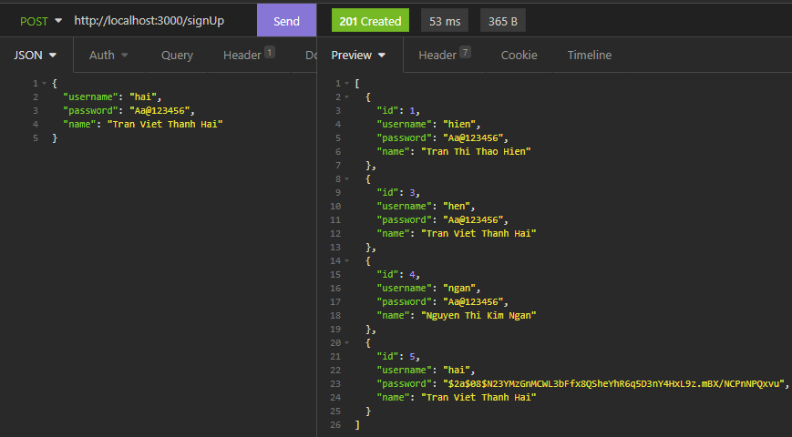
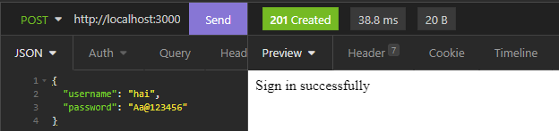
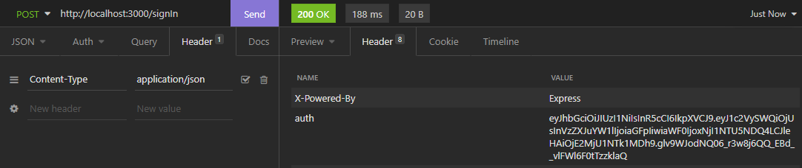
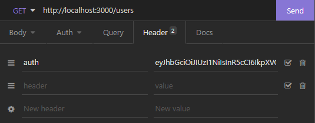
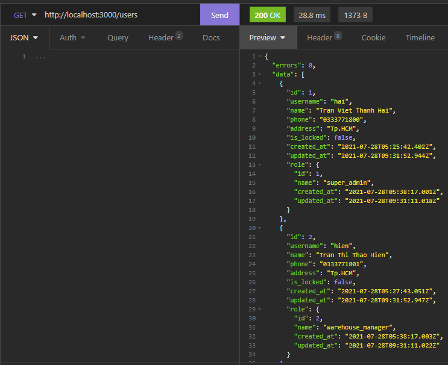
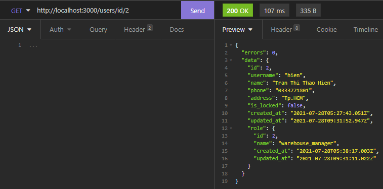
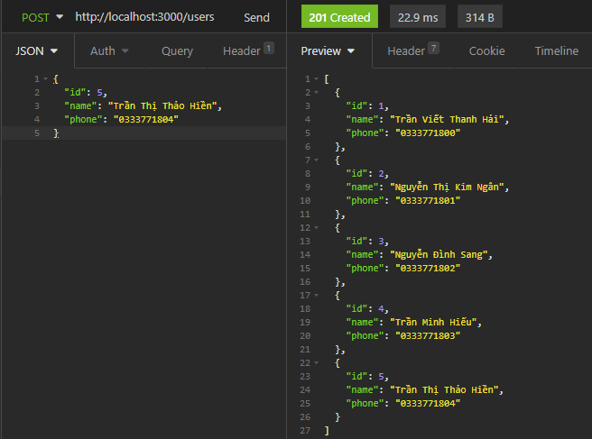
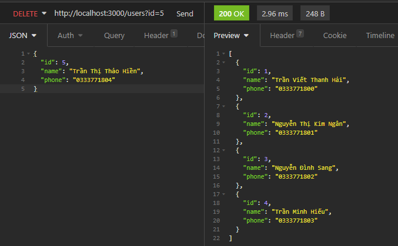

# Table of content
* [Giới thiệu](#Giới-thiệu)
* [Điều kiện tiên quyết](#Điều-kiện-tiên-quyết)
* [Cách cài đặt](#Cách-cài-đặt)
* [Cách sử dụng](#Cách-sử-dụng)
	* [Hướng dẫn sử dụng ứng dụng bằng Insomnia](#Hướng-dẫn-sử-dụng-ứng-dụng-bằng-Insomnia)
		* [Get all users](#Get-all-users)
		* [Get user by id](#Get-user-by-id)
		* [Create a new user](#Create-a-new-user)
		* [Delete a user](#Delete-a-user)
		* [Sign Up](#Sign-Up)
		* [Sign In](#Sign-In)
* [Thông tin liên lạc](#Thông-tin-liên-lạc)

## Giới thiệu
Ứng dụng quản lý danh sách công việc cần làm, được viết bằng JavaScript.

## Điều kiện tiên quyết
Đã cài đặt nodejs <https://nodejs.org/en/download/>

## Cách cài đặt
* **Bước 1**: Cài đặt những thư viện cần thiết cho dự án
```console
$ npm install nest -g
$ npm install
```
* **Bước 2**: Thiết lập thông tin tại file `./.env`
* **Bước 3**: Khởi chạy dự án
```console
$ npm start
```

## Cách sử dụng
### Hướng dẫn sử dụng ứng dụng bằng Insomnia
Cài đặt Insomnia <https://insomnia.rest/download>

#### Sign Up
`Route (POST) /signUp`
<p align="left">
	
</p>

#### Sign In
`Route (POST) /signIn`
<p align="left">
	
</p>
Hệ thống sẽ trả về biến auth trong Header
<p align="left">
	
</p>

#### Get all users
`Route (GET) /users`
Thêm biến auth vào Header trong những route tiếp theo
Chú ý: Nếu dùng bằng browser, bạn không phải thực hiện bước mày mà hệ thống sẽ tự động ghi vào browser.
<p align="left">
	
</p>
Tiếp tục
<p align="left">
	
</p>

#### Get user by id
`Route (GET) /users/:id`
<p align="left">
	
</p>

#### Create a new user
`Route (POST) /users`
<p align="left">
	
</p>

#### Delete a user
`Route (DELETE) /users?id=`
<p align="left">
	
</p>


## Thông tin liên lạc
Rất mong nhận được nhận được ý kiến, nhận xét của bạn đọc.
Nếu có bất kì thắc mắc gì, vui lòng liên hệ địa chỉ email sau:
* **Hải Trần** &lt;tranvietthanhhaiit@gmail.com&gt;
