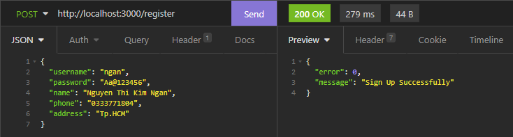
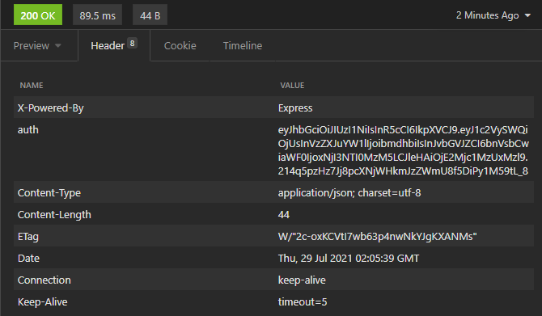
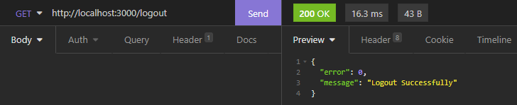
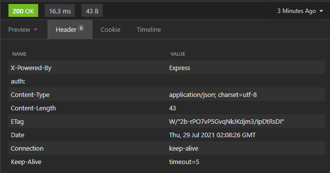
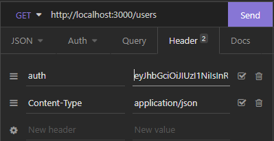
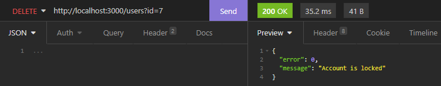
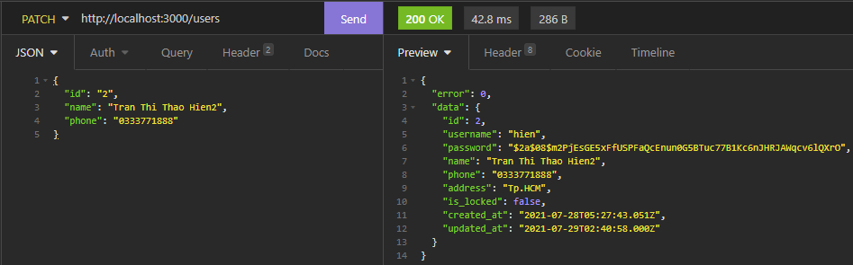

# Table of content

-   [Giới thiệu](#Giới-thiệu)
-   [Điều kiện tiên quyết](#Điều-kiện-tiên-quyết)
-   [Cách thực thi](#Cách-thực-thi)
    -   [Thực thi với npm](#Thực-thi-với-npm)
    -   [Thực thi với docker](#Thực-thi-với-docker)
-   [Cách sử dụng](#Cách-sử-dụng)
    -   [Hướng dẫn chung](#Hướng-dẫn-chung)
    -   [Hướng dẫn sử dụng ứng dụng với Insomnia](#Hướng-dẫn-sử-dụng-ứng-dụng-với-Insomnia)
        -   [Register]
        -   [Login]
        -   [Logout]
        -   [User](#User)
            -   [Get all users](Get-all-users)
            -   [Get user by user's id](Get-user-by-user's-id)
            -   [Get user by user's name](Get-user-by-user's-name)
            -   [Get user by user's phone](Get-user-by-user's-phone)
            -   [Create a new user](Create-a-new-user)
            -   [Lock a user](Lock-a-user)
            -   [Update a user](Update-a-user)
        -   [Sale]
        -   [Item]
        -   [Warehouse]
        -   [Importing]
        -   [Exporting]
-   [Thông tin liên lạc](#Thông-tin-liên-lạc)

# Giới thiệu

Ứng dụng shopping online, được viết bằng ngôn ngữ JavaScript 😑😑

# Điều kiện tiên quyết

Đã cài đặt nodejs <https://nodejs.org/en/download/>

Đã cài đặt thư viện `ts-node (v10.1.0)`

```console
$ npm install ts-node@10.1.0 -g
```

# Cách thực thi

## Thực thi với npm

-   **Bước 1**: Mở cmd tại source code

-   **Bước 2**: Cài đặt những thư viện cần thiết cho dự án

```console
$ npm install nest -g
$ npm install
```

-   **Bước 3**: Đổi tên file `./.env.example` thành `./.env`

-   **Bước 4**: Thiết lập biến môi trường tại file `./.env`

-   **Bước 5**: Khởi chạy ứng dụng | tự động tạo các bảng đã định nghĩa (nếu chưa có bảng đó)

```console
$ npm start
```

-   **Bước 6(Tùy chọn)**: Tạo dữ liệu mẫu

```console
$ npm run db:sync
```

## Thực thi với docker

-   **Bước 0**: Cài đặt docker <https://www.docker.com/products/docker-desktop>

-   **Bước 1**: Mở cmd tại source code

-   **Bước 2**: Cài đặt những thư viện cần thiết cho dự án

```console
$ npm install nest -g
$ npm install
```

-   **Bước 3**: Đổi tên file `./.env.example` thành `./.env`

-   **Bước 4**: Thiết lập biến môi trường tại file `./.env`

-   **Bước 5**: Deploy ứng dụng với docker

```console
$ docker-compose up
```

# Cách sử dụng

## Hướng dẫn chung

Xem hướng dẫn tại http://your-hosts/#/

## Hướng dẫn sử dụng ứng dụng với Insomnia

Cài đặt Insomnia <https://insomnia.rest/download>

### Register

`Route (POST) /register`

<p align="left">
	
</p>

### Login

`Route (POST) /login`

<p align="left">
	
</p>
Hệ thống sẽ trả về biến auth trong Header
<p align="left">
	
</p>

### Logout

`Route (GET) /logout`

<p align="left">
	
</p>

Hệ thống sẽ làm rỗng biến auth trong Header

<p align="left">
	
</p>

Thêm biến auth vào Header trong những route tiếp theo
Chú ý: Nếu dùng browser, bạn không phải thực hiện bước mày mà hệ thống sẽ tự động ghi vào browser.

<p align="left">
	
</p>

### User

#### Get all users

`Route (GET) /users`

<p align="left">
	
</p>

#### Get user by user's id

`Route (GET) /users/id/:id`

<p align="left">
	
</p>

#### Get user by user's name

`Route (GET) /users/name/:name`

<p align="left">
	
</p>

#### Get user by user's phone

`Route (GET) /users/phone/:phone`

<p align="left">
	
</p>

#### Create a new user

`Route (POST) /users`

<p align="left">
	
</p>

#### Lock a user

`Route (DELETE) /users?id=`

<p align="left">
	
</p>

#### Update a user

`Route (PATCH) /users`

<p align="left">
	
</p>

### Sale

### Item

### Warehouse

### Importing

### Exporting

# Thông tin liên lạc

Rất mong nhận được nhận được ý kiến, nhận xét của bạn đọc.
Nếu có bất kì thắc mắc gì, vui lòng liên hệ địa chỉ email sau:

-   **Hải Trần** &lt;tranvietthanhhaiit@gmail.com&gt;
